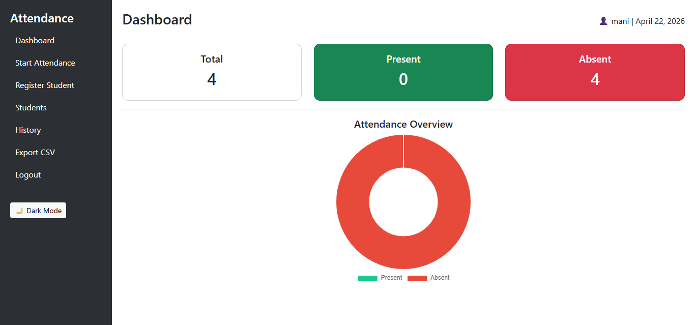
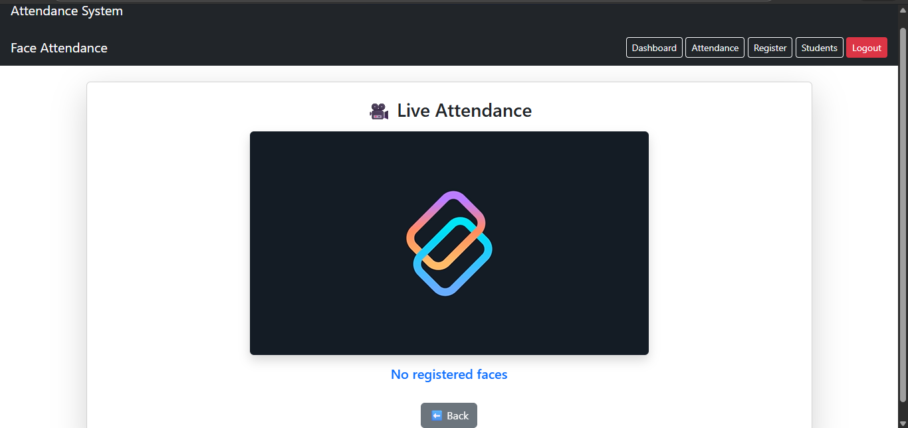
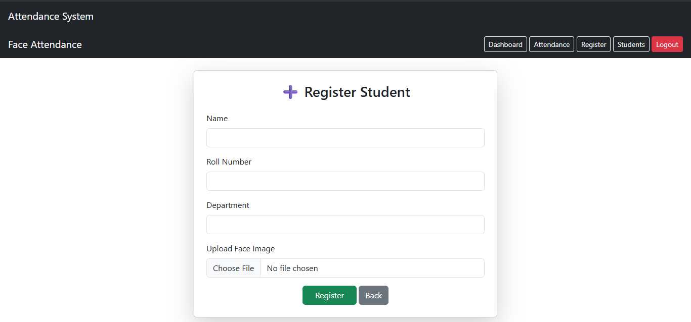

# 🎓 Face Recognition Attendance System

AI-powered web application that automates attendance using real-time face recognition built with Django, OpenCV, and face_recognition.

---

## 🚀 Features

* 🔐 Admin Login System
* 👤 Student Registration with Face Image
* 🎥 Real-time Face Recognition via Webcam
* ✅ Automatic Attendance Marking
* ❌ Prevent Duplicate Attendance (same day)
* 📊 Dashboard with Live Statistics & Charts
* 📜 Attendance History (Search, Filter, Pagination)
* 📥 Export Attendance to CSV
* 🌙 Dark Mode UI
* 📱 Responsive Design

---

## 🛠 Tech Stack

* **Backend:** Django
* **Frontend:** HTML, CSS, Bootstrap, JavaScript
* **Computer Vision:** OpenCV, face_recognition
* **Database:** SQLite (can be upgraded to PostgreSQL)

---

## 📂 Project Structure

attendance_management/
│
├── attendance/
│   ├── models.py
│   ├── views.py
│   ├── urls.py
│   ├── forms.py
│   ├── utils.py
│   ├── templates/
│   ├── static/
│
├── attendance_management/
│   ├── settings.py
│   ├── urls.py
│
├── manage.py
├── requirements.txt
└── README.md

---

## ⚙️ Installation

### 1. Clone the repository

git clone https://github.com/YOUR_USERNAME/face-recognition-attendance.git
cd face-recognition-attendance

---

### 2. Create virtual environment

python -m venv venv
venv\Scripts\activate

---

### 3. Install dependencies

pip install -r requirements.txt

---

### 4. Run migrations

python manage.py migrate

---

### 5. Start server

python manage.py runserver

---

## 📷 Usage

1. Register students with clear face images
2. Open **Start Attendance** page
3. System detects faces in real-time
4. Attendance is automatically recorded

---

## 📸 Screenshots

(Add your screenshots inside a `screenshots/` folder)

screenshots/
├── dashboard.png
├── attendance.png
├── register.png

Then display in README:

---

## ⚠️ Important Notes

* Use clear, front-facing images
* Avoid low light or blurry photos
* Only one face per image
* Ensure webcam permission is enabled

---

## 🚀 Future Improvements

* Email-based password reset (OTP)
* Webcam-based face capture during registration
* Multi-image training for better accuracy
* Deployment (Render / Railway / AWS)
* Advanced analytics dashboard

---

## 👨‍💻 Author

Muthumanikandan K
Email: [kmuthumani57@gmail.com](mailto:kmuthumani57@gmail.com)
LinkedIn: https://www.linkedin.com/in/muthumanikandankcse

---

## ⭐ Support

If you like this project, give it a ⭐ on GitHub!
